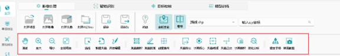
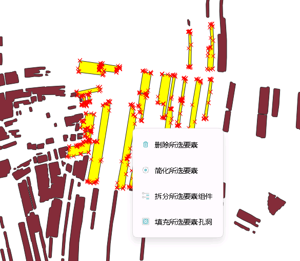

[TOC]

------

# 声明：

欢迎使用吉林一号遥感解译平台桌面端软件，在使用软件之前，请首先阅读本使用手册，本手册仅适用于本软件。

本手册未经许可，不得以任何目的、形式复制或传播本手册得任何部分。本公司有权根据软件产品现有功能对软件做出修改，如手册内容与实际软件不符，请以实际软件为准。

本手册中所提到的某些产品或标识仅作识别之用，这些名称或产品可能属于其他公司的注册商标或版权。

# 该文档适用版本：

**吉林一号遥感解译平台桌面端软件** v1.0 及以上

# 第一章 软件介绍

## 1.1 软件概述

吉林一号遥感解译平台桌面端软件是一款智能遥感影像解译软件产品，涵盖常用GIS功能、栅格处理、矢量处理、智能解译、辅助勾画工具等模块，统一化数据解译输入输出，涵盖大多数GIS智能数据挖掘场景，深度发掘吉林一号海量数据源价值。

## 1.2 开源框架使用说明

本软件中使用了开源框架，具体为如下：

- GIS功能框架 -- osgeo4w，pyqgis
- 信息提取框架 -- MobileSAM
- GUI界面 -- pyqt5
- UI组件库 -- pyqt-fluent-widgets

# 第二章 软件安装

## 2.1 软件安装系统和硬件环境

该软件分为cpu版本和GPU版本，详细的支持列表请参照：

软件支持的系统环境为如下：

- Windows 10
- Windows 11
- Windows Server 2012及以上

软件的最低硬件环境为如下：

- 处理器：高于1GHz 32位 或 64位的处理器
- 运行内存：大于8G的运行内存
- 硬盘空间：大于50G的硬盘空间
- 显卡： 若使用Gpu版本，则需要使用大于等于6G的显存显卡
- 显示器： 建议分辨率在1920×1080像素以上

软件的推荐硬件环境为如下：

- cpu：高于1GHz 64位处理器
- 运行内存：32G运行内存
- 硬盘空间：大于100G硬盘空间
- gpu： 支持cuda10、cuda11及以上的GPU显卡（如：3060、TITAN等）
- 显示器： 1920×1080像素

软件推荐配置示例：

- cpu：Intel(R) Core(TM) i7-10890H CPU
- 运行内存： 32GB
- 硬盘空间：1TB
- gpu： NVIDIA GeForce RTX 3060/70/80/90(Ti)、2070/80/90 (Ti)、1080(Ti)、A100
- 显示器：1920×1080像素

## 2.2 软件安装步骤

根据系统的GPU版本（无GPU请安装cpu版本），下载遥感数据挖掘软件安装包.exe后，点击运行，将会弹出如下界面：

安装语言支持简体中文与英文。点击确定后，将会弹出安装地址选择：

在用户选择好地址后（最好不要包含中文与空格），点击下一步，将会弹出是否创建桌面快捷方式的提示框：

在用户选择好是否创建桌面快捷方式后，点击下一步，将会进行最终的确认：

在用户点击安装后，将进入正式安装界面：

在等待一段时间后，安装完成。到此为止，便完成了软件的安装。在运行后，会首先弹出如下加载界面：	

 

# 第三章 软件使用详细说明

## 3.1 软件界面概要

本软件界面打开如下所示，软件打开后默认进入主页：

主页有以下功能：

- A.地图画布区域，将会渲染软件中加载的所有对象（影像、矢量）。<位于软件界面中央>
- B.图层管理区域，将会在此管理软件中的A.地图画布区域的所有渲染对象。<位于软件界面左侧>
- C.菜单栏区域，该区域的菜单栏拥有软件中的大部分功能，用户需点击使用。<位于软件界面顶层>
- D.工具箱区域，该区域展示软件的所有工具，用户可以直接点击对应的工具进行使用。<位于软件界面右侧>
- E.状态栏区域，该区域会实时展示软件的一些状态，如鼠标当前位置、坐标系等信息。<位于软件界面底部>

单击最左侧界面栏的《单景标注》，软件将进入单景标注页面，单景标注可以对单期的影像、本地的数据集进行快捷勾画。

单击最左侧界面栏的《变化标注》，软件将进入变化标注页面，变化标注可以对前后两期影像或变化检测数据集进行快捷勾画。

## 3.2 软件主页界面功能说明

本软件主页界面中有多个需要解释的控件或界面区域，下面将会一一说明：

### 3.2.1 地图画布

该区域是软件中最重要的展示区域，软件中打开的遥感影像及矢量文件都会显示在该区域。在地图画布中点击鼠标右键，将会弹出如下菜单栏：

菜单栏中包含“复制坐标”和“切换图层坐标系”两个功能。

#### 3.2.1.1 复制坐标

点击“复制坐标功能“后，软件将会把当前鼠标所在坐标点复制到电脑的剪贴板中，格式如下所示：

1770902.904416,2960315.302905 （X坐标，Y坐标）

#### 3.2.1.2 切换图层坐标系

点击“切换图层坐标系”后，软件将弹出切换图层坐标系的窗格，用户可以改变地图画布的坐标系。

### 3.2.2 图层树

软件主页的左侧为图层树，该部分存储了地图画布显示的所有地图图层，用户可在该区域对地图画布图层进行管理操作。图层树上方拥有三个图标，他们的功能分别为”展开图层“，”折叠图层“，”移除选中图层“

#### 3.2.2.1 拖拽功能

软件图层树支持外部拖拽，用户只需按住合法格式的文件，往软件里拖拽，系统便会自动将文件加载入地图画布和图层树中。

### 3.2.3 工具箱

软件内自带矢量处理、栅格处理工具，用户可以通过在工具箱中选择对应的工具，也可以直接点击菜单栏中的图标使用对应的工具。工具箱关闭状态下可以点击软件右侧的按钮调出工具箱，在不使用工具箱时也可以点击右上角的关闭按钮关闭工具箱。

### 3.2.4 菜单栏

软件顶部区域为菜单栏，内置了软件绝大部分功能，关于此部分请跳转后续章节详细查看。

### 3.2.5 状态栏

软件底部为状态栏，记述了软件的当前鼠标位置、比例尺与坐标系。

## 3.3 菜单栏-通用工具

菜单栏下方的工具为通用工具，通常可以满足大部分任务需求。

### 3.3.1 漫游与缩放

在添加影像后，点击菜单栏中的漫游工具 ，按压鼠标左键或滚轮，将会按照鼠标轨迹平移地图画布。
若在使用其他地图工具后，想重置为漫游功能，可以点击菜单栏–漫游工具 进行重置。点击放大工具 ，将左键事件更改为放大地图画布，同理缩小工具 左键事件更改为缩小地图画布，若想回到某图层的全部视图范围，可以点击全局缩放按钮 ，或者右键该图层–缩放到图层即可。

### 3.3.2 选择要素

当点击菜单栏–选择工具 后，软件会默认将地图工具变更为选择当前矢量图层要素功能，其功能如下：

- 鼠标左键点击地图画布，若当前点击位置存在要素，则会将其他所有选中要素清除选中，并选中当前位置要素，若不包含，则会清除所有选中要素。
- 拖拽鼠标左键，将会绘制一个虚拟矩形框，当放开鼠标左键时，若当前的虚拟矩形框包含了要素，则会将其他所选中要素清除选中，并选中虚拟矩形框包含的要素，若不包含，则会清除所有选中要素。
- 在上述过程中若同时按住了Ctrl键，则不会清除选中的要素。

若想取消矢量要素的选中，点击一个没有要素的区域即可清除。

若当前矢量图层已处于编辑状态，则右键选择要素会弹出如下菜单栏：

菜单栏的四个功能分别为：删除所选要素、简化所选要素、拆分所选要素组件、填充所选要素孔洞。

### 3.3.3 新建矢量

点击菜单栏-新建矢量后，将会弹出如下窗口：

选择文件存储位置、几何图形类型等参数后点击OK，便可新建矢量文件。

### 3.3.4 编辑矢量

在图层列表中选择需要编辑的矢量，点击菜单栏-开始编辑后，菜单栏会显示编辑工具：

选择对应编辑工具便可对矢量进行编辑，编辑完成后点击保存编辑按钮或开始编辑按钮即可完成矢量保存工作。

### 3.3.5 撤销 `Ctrl+Z`与重做 `Ctrl+Shift+Z`

**功能描述**：撤销与重做功能允许用户在编辑过程中撤销上一步操作或重新执行已撤销的操作，确保用户在操作过程中能够灵活调整，避免因误操作导致的数据丢失。

**操作步骤**：点击工具栏中的“撤销”按钮（或按快捷键 `Ctrl+Z`），撤销上一步操作。若要重新执行已撤销的操作，点击工具栏中的“重做”按钮（或按快捷键 `Ctrl+Shift+Z`）。

### 3.3.6 绘制要素`E`

**功能描述**：绘制要素功能允许用户在地图上创建新的矢量面要素，用于标注地理信息或构建新的地理数据。

**操作步骤**：

1. 在工具栏中选择“绘制要素”工具。
2. 选择要绘制的要素类型（点、线、面）。
3. 在地图上点击鼠标以创建要素的第一个点。
4. 逐步点击鼠标添加点，或双击鼠标开启“流模式”编辑，点将会跟随用户鼠标逐帧创建，再次双击取消“流模式”。
5. 在绘制过程，点击`Backspace`可取消上一个点或上一串流模式的点。
6. 完成绘制后，点击右键按钮保存要素。

### 3.3.7 裁剪要素`Z`

**功能描述**：裁剪要素功能允许用户根据指定的边界或区域裁剪矢量要素，用于提取特定范围内的地理信息。

**操作步骤**：

1. 在工具栏中选择“裁剪要素”工具。
2. 提前选择需要裁剪的矢量要素的话，接下来的裁剪操作仅会针对选择好的要素，若不选择，则裁剪操作会自动判断相交的要素。
3. 绘制裁剪边界。
4. 点击右键按钮，系统将自动裁剪要素并保存结果。

### 3.3.8 编辑折点`X`

**功能描述**：编辑折点功能允许用户调整线或面要素的折点位置，用于优化要素的形状或精度。

**操作步骤**：

1. 在工具栏中选择“编辑折点”工具。
2. 选择需要编辑的面要素。
3. 点击折点，拖动鼠标调整折点位置，或点击线中间，增加折点。
4. 双击要素外部确认修改。

### 3.3.9 重塑形状`C`

**功能描述**：重塑形状功能允许用户通过重新定义要素的边界或轮廓，修改矢量要素的形状，适用于修正或调整地理要素的外观。

**操作步骤**：

1. 在工具栏中选择“重塑形状”工具。
2. 提前选择需要重塑的矢量要素的话，接下来的重塑操作仅会针对选择好的要素，若不选择，则重塑操作会自动判断相交的要素。
3. 绘制新的边界或轮廓以重新定义要素形状。
4. 点击“确认”按钮保存修改，或点击“取消”按钮放弃操作。

### 3.3.10 合并矢量`F1`

**功能描述**：合并矢量功能允许用户将多个矢量要素合并为一个要素，常用于整合相邻的区域。

**操作步骤**：

1. 选择需要合并的矢量要素（可多选）。
2. 点击“合并矢量”按钮，系统将自动合并要素并保存结果。

### 3.3.11 删除矢量`Del`

**功能描述**：删除矢量功能允许用户移除地图上的矢量要素，用于清理不需要的地理信息。

**操作步骤**：

1. 选择需要删除的矢量要素（可多选）。
2. 点击“删除”按钮确认操作。

### 3.3.12 修改属性`F2`

**功能描述**：修改属性功能允许用户编辑矢量要素的属性信息，用于更新或补充地理数据的描述。

**操作步骤**：

1. 在工具栏中选择“修改属性”工具。
2. 选择需要修改属性的矢量要素。
3. 在弹出的属性表中，点击需要修改的字段，输入新的属性值。
4. 点击“保存”按钮确认修改，或点击“取消”按钮放弃操作。

### 3.3.13 测量面积

点击菜单栏-测量面积 ，将会弹出如下窗口：

其中笛卡尔坐标系用于在二维平面坐标系（如UTM、高斯-克吕格投影）中直接计算几何图形的欧氏距离或面积。而基于椭球体的测量考虑地球椭球模型（如WGS84、CGCS2000），通过测地线计算真实地表距离或曲面面积。用户可以根据地图坐标选择测量方式，并使用鼠标左键在地图绘制测量区域。绘制结束后在测量窗口中可以看到测量结果。

### 3.3.14 测量距离

点击菜单栏-测量距离，将会弹出如下窗口：

参考测量面积，使用鼠标左键绘制线段，点击鼠标右键结束绘制，在上面的窗口中可以看到测量结果。

### 3.3.15 创建渔网

点击菜单栏-创建渔网 ，将会弹出如下窗口：

其中像素模式会按照像素数量生成渔网，例如渔网像素值为1000时会生成1000×1000像素规格的渔网网格；间隔模式则会将目标区域按照x×y的数量平均生成渔网。

### 3.3.16 矢量导出

点击菜单栏–矢量导出 后，将弹出如下窗口：

选择需要导出的矢量，设置目标坐标系，选择结果路径后，将会为选定矢量完成导出矢量操作。若只需导出矢量中的指定要素，则需要使用菜单栏-选择工具，在地图中选择需要导出的要素，随后在导出窗口中勾选“仅导出选中的要素”便可导出选中要素。

### 3.3.17 计算质心

计算质心是指为矢量要素（点、线、面）生成其几何中心点的操作。点击菜单栏–计算质心后，将弹出如下窗口：

选择好参数后，将会为选定矢量完成计算质心操作，下面展示了为中国每一个行政区计算质心的结果：

### 3.3.18 矢量相减

点击菜单栏–矢量相减后，将弹出如下窗口：

选择好参数后，将会为选定矢量删减相减矢量，例如使用中国地图减去吉林省得到如下结果（示例）：

### 3.3.19 矢量正交

矢量正交是指通过调整矢量要素的几何形状，使其边缘或线段之间形成直角关系的处理过程。这一操作主要应用于人工地物（如建筑物、道路网格等）的几何修正，使其符合现实世界中直角结构的特征。

点击菜单栏–矢量正交后，将弹出如下窗口：

选择好参数后，将会为选定矢量完成矢量正交操作。

### 3.3.20 计算面积

点击菜单栏–计算面积 后，将弹出如下窗口：

选择好参数后，将会为选定矢量完成计算面积操作，新生成的矢量会增加area字段，若原本存在area字段则会覆盖原数据。

### 3.3.21 建金字塔

“建金字塔”通常是指在图像处理和计算机视觉领域中，将一幅图像通过一系列缩小的步骤生成不同分辨率的图像集合。点击菜单栏–建金字塔 后，将弹出如下窗口：

选择好参数，如果勾选“内建金字塔”，会以内建的方式生成金字塔。如果不勾选则会生成后缀为.ovr文件。如果勾选删除现有金字塔则会删除影像已有的金字塔，点击确定后将会为影像生成金字塔。

## 3.4 影像处理

### 3.4.1 打开项目

点击菜单栏-影像处理-打开项目，将会弹出文件选择窗口，选择项目文件（qgs,qgz）文件后点击打开即可打开项目文件。

### 3.4.2 添加本地栅格影像图层

在常见的GIS影像数据中，一般将其称为“栅格影像数据”，即以二维矩阵的形式来表示空间信息的数据组织方式，每个矩阵单位成为一个栅格单元。目前软件支持的栅格格式有：

- GeoTIFF(.tif ; .tiff ; .TIF ; .TIFF)

点击菜单栏--常规--打开影像：

将会弹出如下选择影像窗口：

选择影像文件后，软件的图层中将会添加选择的影像对象，且地图画布同时会渲染添加的影像：

同样，可以直接将文件拖拽到软件中进行影像加载。右键该图层，点击属性后（亦可双击该图层），出现如下窗口：

属性窗口将会记录文件的名称、路径、占用空间、范围、宽度、高度、数据类型、波段数量和坐标系。

点击图层属性的”渲染“窗口，将会切换到如下渲染窗格：

可在此处进行影像的红色波段、绿色波段、蓝色波段渲染切换、对比度、饱和度、混合模式等方面的渲染高级设置，点击应用后，图层的影像渲染便会切换为选中的渲染方式。

### 3.4.3 添加矢量图层

在常见的GIS矢量数据中，一般将矢量称为“矢量数据”，即以点、线、面的矢量来标识遥感影像，目前软件支持的本地矢量格式有：

- ESRI Shapefile(.shp ; .shz ; .SHP ; .SHZ)

点击菜单栏--常规--打开矢量：

将会弹出如下选择影像窗口：

选择矢量文件后，软件的图层中将会添加选择的矢量对象，且地图画布同时会渲染添加的矢量：

同样，我们可以直接将文件拖拽到软件中进行矢量加载。

#### 3.4.3.1 打开属性表

右键矢量图层--打开属性表即可查看矢量图层的属性表。

#### 3.4.3.2 单一渲染矢量

若不关注矢量的属性表信息，则矢量的渲染方式只需使用普通渲染模式，当用户加载矢量后，默认矢量渲染模式为实心--随机颜色的渲染方式。双击图层或右键图层--渲染设置后，将弹出如下窗口：

将渲染类型改为空心，颜色改为红色，矢量将被渲染为如下：

#### 3.4.3.3 分类渲染矢量

用户有一个地物分类矢量，加载后的默认渲染矢量为如下：

双击图层或右键图层--渲染设置后，选择分类渲染字段，分类渲染结果为如下：

#### 3.4.3.4 标注矢量

选择矢量，点击右键-标注，点击”开启标注”，设置标注字段、颜色与字体大小，即可对矢量进行标注。

### 3.4.4 保存与另存项目

点击菜单栏-影像处理-保存项目，选择保存位置后点击确认即可保存当前项目，另存项目同理。

### 3.4.5 帮助

点击菜单栏-影像处理-帮助 ，将会弹出本软件使用手册。

### 3.4.6 坐标查询

点击菜单栏-影像处理-坐标查询 ，在右边输入框中输入坐标，然后点击回车，便可以在地图中查询坐标所在位置。

### 3.4.7 卷帘

点击菜单栏-影像处理-卷帘 ，在弹出的输入框中选择用于变化对比的图形,用户可以使用鼠标选择左右或者上下方向进行对比。

## 3.5 智能识别（仅GPU版本适用）

本软件的智能识别可以提取遥感影像中的地物，并以贴合边界的栅格解译结果反馈到图层中。智能提取功能分为语义分割、目标检测提取、批量解译和自定义提取。

### 3.5.1 智能识别功能

本软件中内置了多个语义分割、目标检测提取模型，下面将以建筑物信息提取为例进行说明，用户首先加载本地遥感影像：

点击菜单栏-智能识别–建筑物提取 后，将弹出如下窗口：

各个参数的含义如下：

**解译尺寸**：指语义分割任务中将输入影像划分的切片（瓦片）的像素尺寸。平衡计算效率与显存占用，减少边缘效应，确保大影像可分块处理。尺寸过小会导致分割碎片化，过大可能超出硬件负载。

**重叠率**：相邻切片之间的重叠区域占切片边长的百分比，可以消除瓦片接缝处的分割不一致性，提升目标边缘的连续性，尤其对不规则地物（如植被、道路）至关重要。

**简化程度：**对分割结果多边形几何的简化强度，可以减少冗余节点以降低数据复杂度，平衡几何精度与处理效率，适用于制图或分析前的数据优化。

**碎斑滤除面积：**过滤掉无意义微小多边形的最小面积阈值。

**空洞滤除面积：**填充多边形内部孔洞的最大允许面积阈值。

选择好计算的GPU与保存位置与后，点击确定，等待计算机运行后，将得到如下的结果：

### 3.5.2 批量解译

本软件提供批量解译功能，用户可以对影像同时进行多种地物的提取，假设用户已经加载需要解译的遥感影像，选择智能识别-批量解译 功能，弹出如下参数设置窗口：

点击选择模型 ，软件会提供所有可供选择的语义分割与目标检测任务，用户也可以点击添加所有 ，软件将自动添加所有的提取任务：

参数设置参考语义分割与目标识别部分解释，设置好参数后选择结果文件夹，软件会自动识别列表中的地物种类。

### 3.5.3 自定义提取

本软件提供自定义提取功能，需要配合模型训练模块进行使用，该模块的介绍见后续模型训练介绍。假设用户已通过模型训练模块训练得到了模型，选择智能识别-自定义提取 功能，弹出如下参数设置窗口：

点击选择配置文件，选择模型训练结果文件夹中的xxx.py文件，点击选择权重文件，选择模型训练结果文件夹中的best_mIoU_iter_**.pth权重文件。其他参数的设置同样参考语义分割参数设置，最后点击确定开始提取。

## 3.6 目标校核

### 3.6.1 栅格矢量化

本软件附带了栅格矢量化功能，可以将信息提取、地物分类等算法解译后的栅格结果变为可编辑的矢量。假设用户拥有一个耕地提取单波段栅格结果：

点击菜单栏--栅格处理--栅格矢量化后，将弹出如下窗口：

待转换栅格选择单波段的耕地提取栅格结果；赋值字段系统默认为Value，亦可修改为自己想要的字段，将像素值保留到该字段中；八向联通勾选项为是否使用八向联通法进行矢量化处理；输出矢量为保存的本地矢量地址。转换后，将会得到如下矢量结果：

### 3.6.2 导出栅格

本软件支持导出栅格。点击菜单栏--栅格处理--导出栅格后，将弹出如下窗口：

选择好结果路径后， 将会导出为一个新的栅格文件。

### 3.6.3 波段重组合

波段重组合功能是一种重要的图像处理技术，它允许用户将不同波段的数据进行组合，以进行栅格文件的波段自定义配置。

点击菜单栏--栅格处理--波段重组合后，将弹出如下窗口：

选择好参数后，将会按照重组合的影像波段顺序导出为一个新的栅格文件。

### 3.6.4 生成金字塔

功能如3.3.21建金字塔所述。

### 3.6.5 栅格重投影

点击菜单栏--栅格处理--栅格重投影后，将弹出如下窗口：

选择好参数后，将会为选定影像完成栅格重投影操作,生成新的指定坐标系栅格影像并加载至图层中。

### 3.6.6 栅格裁剪

点击菜单栏--栅格处理--栅格裁剪后，将弹出如下窗口：

选择好参数后，将会为选定影像完成栅格裁剪操作。

#### 3.5.6.1 基于范围裁剪

基于范围裁剪栅格将会根据选定的地图范围，亦或是在地图上绘制后，根据范围四角点裁剪栅格。

#### 3.5.6.2 基于掩膜裁剪

基于掩膜裁剪栅格将会根据选定的掩膜矢量，根据掩膜矢量范围裁剪栅格。

### 3.6.7 栅格合并

点击菜单栏--栅格处理--栅格合并后，将弹出如下窗口：

选择好待合并的多个栅格图层和插值参数后，将会为选定影像完成栅格合并操作。

### 3.6.8 栅格计算

点击菜单栏--栅格处理--栅格计算后，将弹出如下窗口：

用户可根据自身需求构建栅格计算表达式，当表达式计算有效时，底部的表达式状态栏会显示”表达式有效“，只有当表达式有效时才可以进行栅格运算。另外，软件还附带了多个快速指数计算公式，可供用户快捷输入。

选择好参数后，将会为选定影像完成栅格计算操作。

### 3.6.9 栅格分区统计

点击菜单栏--栅格处理--栅格分区统计后，将弹出如下窗口：

选择好参数后，将会为选定影像完成栅格分区统计操作。

### 3.6.10 矢量栅格化

本软件附带了矢量栅格化结果，可将矢量格式的解译结果转换为栅格结果。

点击菜单栏--矢量处理--矢量栅格化后，将弹出如下窗口：

选择好参数后，将会为选定矢量完成矢量栅格化操作。

### 3.6.11  导出矢量

点击菜单栏--矢量处理--导出矢量后，将弹出如下窗口：

选择好参数后，将会为选定矢量完成导出矢量操作。

### 3.6.12 修正几何

点击菜单栏--矢量处理--修正几何后，将弹出如下窗口：

选择好参数后，将会为选定矢量完成修正几何操作。

### 3.6.13 矢量裁剪

点击菜单栏--矢量处理--矢量裁剪后，将弹出如下窗口：

选择好参数后，将会为选定矢量完成矢量裁剪操作。

### 3.6.14 矢量相减

点击菜单栏--矢量处理--矢量相减后，将弹出如下窗口：

选择好参数后，将会为选定矢量完成矢量相减操作。

### 3.6.15 矢量简化

点击菜单栏--矢量处理--矢量简化后，将弹出如下窗口：

选择好参数后，将会为选定矢量完成矢量简化操作。

### 3.6.16 矢量缓冲

点击菜单栏--矢量处理--矢量缓冲后，将弹出如下窗口：

选择好参数后，将会为选定矢量完成矢量缓冲操作。

### 3.6.17 矢量相交

点击菜单栏--矢量处理--矢量相交后，将弹出如下窗口：

选择好参数后，将会为选定矢量完成矢量相交操作。

### 3.6.18 矢量正交

点击菜单栏--矢量处理--矢量正交后，将弹出如下窗口：

选择好参数后，将会为选定矢量完成矢量正交操作。

### 3.6.19 计算质心

点击菜单栏--矢量处理--计算质心后，将弹出如下窗口：

选择好参数后，将会为选定矢量完成计算质心操作。

### 3.6.20 计算面积

点击菜单栏--矢量处理--计算面积后，将弹出如下窗口：

选择好参数后，将会为选定矢量完成计算面积操作。

### 3.6.21 矢量融合

点击菜单栏--矢量处理--矢量融合后，将弹出如下窗口：

选择好参数后，将会为选定矢量完成矢量融合操作。

### 3.6.22 转单部件

点击菜单栏--矢量处理--转单部件后，将弹出如下窗口：

选择好参数后，将会为选定矢量完成转单部件操作。

### 3.6.23 矢量平滑

点击菜单栏--矢量处理--矢量平滑后，将弹出如下窗口：

选择好参数后，将会为选定矢量完成矢量平滑操作。

### 3.6.24 矢量合并

点击菜单栏--矢量处理--矢量合并后，将弹出如下窗口：

选择好参数后，将会为选定矢量完成矢量合并操作。

### 3.6.25 矢量重投影

点击菜单栏--矢量处理--矢量重投影后，将弹出如下窗口：

选择好参数后，将会为选定矢量完成矢量重投影操作。

### 3.6.26 滤除碎斑

点击菜单栏--矢量处理-- 滤除碎斑后，将弹出如下窗口：

选择好参数后，将会为选定矢量完成滤除碎斑操作。

### 3.6.27 填充孔洞

点击菜单栏--矢量处理--填充孔洞后，将弹出如下窗口：

选择好参数后，将会为选定矢量完成填充孔洞操作。

## 3.7 标注功能说明

### 3.8.1 单景标注功能介绍

该软件附带了信息提取样本勾画辅助工具，当用户想要勾画遥感影像时，可使用该工具提升遥感影像的标注效率。点击软件最左侧导航栏的单景标注后，软件切换页面到如下状态：

点击右上角的创建项目后，弹出如下参数设置窗口：

从该参数界面可以得知，本软件支持本地影像、在线底图和数据集的样本勾画三大模式。

选择好相应参数后，点击开始（或者直接选择之前创建好的项目文件夹），将会弹出如下界面：

标注界面拥有如下区域：

- A.地图画布区域： 该区域展示了当前切片影像和标注的矢量
- B.地图工具区域： 该区域摆放了多个标注地图工具控件
- C.渔网区域：该区域展示了标注任务的渔网，双击渔网可以跳转到对应的任务切片

### 3.8.2 实际勾画说明

用户可从当前任务格网进度来查看自己的标注进度：

点击上一个（快捷键A)和下一个（快捷键D）可上下切换切片。

用户点击地图工具区域里面的各种标注地图工具控件便可进行标注工作，其详细说明如下：

#### 3.8.2.1 漫游控件（快捷键Q）

漫游控件（快捷键Q）：与软件的漫游功能一致，可进行地图画布的拖拽移动。

#### 3.8.2.2 标注魔术棒控件（快捷键W）

标注魔术棒控件（快捷键W）：可进行智能提取，根据用户单击的该处，生成贴合边界的自动要素：

注意，当前显示的形状并不是最终的要素，用户可以左键点击正样本点，右键点击负样本点进行交互式的智能标注，当觉得满意时，单击键盘的空格键即完成勾画。 

#### 3.8.2.3 面要素勾画控件（快捷键E）

面要素勾画控件（快捷键E）：可进行面要素的勾画：

使用者可以在面要素勾画激活时双击左键进行流模式的勾画，即鼠标拖动就会形成面轨迹，单击取消该模式，单击键盘的退格键可以取消上一次的点勾画

#### 3.8.2.4 矩形要素勾画控件（快捷键R）

矩形要素勾画控件（快捷键R）：可进行水平矩形要素和旋转矩形要素的勾画：

#### 3.8.2.5 圆形要素勾画控件（快捷键T）

圆形要素勾画控件（快捷键T）：可进行圆形要素的勾画：

#### 3.8.2.6 选择要素控件（快捷键S）

选择要素控件（快捷键S）：与软件的选择要素功能一致。

#### 3.8.2.7 删除要素控件（快捷键Del）

删除要素控件（快捷键Del）：点击后，将删除选中的要素。

#### 3.8.2.9 合并要素控件（快捷键F1）

合并要素控件（快捷键F1）：该控件可进行选中要素的合并。假设用户选中了如下两个要素：

合并后变为如下要素：

#### 3.8.2.10 剪切要素控件（快捷键Z）

剪切要素控件（快捷键Z）：该控件可进行选中要素的剪切。假设用户选中了如下要素：

- 

剪切后变为如下要素：

#### 3.8.2.11 编辑顶点控件（快捷键X）

编辑顶点控件（快捷键X）：该控件可进行选中要素的剪切。假设用户选中了如下要素：

- 

编辑顶点如下所示：

#### 3.8.2.12 重塑要素控件（快捷键C）

重塑要素控件（快捷键C）：该控件可进行选中要素的剪切。假设用户选中了如下要素：

- 

重塑后变为如下要素：

#### 3.8.2.13 复制要素控件（快捷键V）

复制要素控件（快捷键V）：该控件可进行选中要素的剪切。假设用户选中了如下要素：

- 

复制后变为如下要素：

#### 3.8.2.14 填充空洞控件（快捷键B)

填充空洞控件（快捷键B): 该控件可以一键填充要素的空洞。

#### 3.8.2.15 撤回与重做

撤回控件(快捷键Ctrl+Z)：点击后，撤回上一次编辑操作。

重做控件(快捷键Shift+Ctrl+Z)：点击后，重做上一次编辑操作。

### 3.8.4 变化检测信息提取样本勾画辅助介绍

除了本地影像的信息提取样本勾画辅助，本软件同样集成了变化检测的勾画辅助功能。其中勾画功能与上述保持一致，不再赘述。

点击软件最左侧导航栏的变化标注后，软件切换页面到如下状态：

## 3.8 模型训练

本软件提供语义分割与目标识别数据集生成、数据集分割以及训练功能，用户可以使用软件自定义地物智能识别，从而智能提取软件没有提供的地物类型或者对提取效果不好的模型进行优化，模型训练分为生成数据集、分割数据集与训练工具。

### 3.8.1 生成数据集

点击左侧“主页”按钮，加载遥感影像以及对应的样本勾画矢量，点击模型训练-生成数据集 按钮，将会弹出如下参数设置按钮：

在创建数据集参数界面，输入数据集相关信息以及输出路径，填写数据集开始索引以及数据库描述等信息，点击确认制作样本数据集，输出文件夹中会新建三个文件夹，其中Img文件夹存放样本的遥感影像切片，Json文件夹存放每张样本的详细信息，Label文件夹存放样本的标签文件,在实际训练过程中主要使用Img中的遥感影像切片和Label中对应的标签文件。

### 3.8.2 分割数据集

软件中分割数据集功能可以将数据集分为训练集、测试集以及验证集，点击模型训练-分割数据集 按钮，将会弹出如下窗口：

选择对应的文件夹，其中影像文件夹为生成数据集中的img文件夹，标签文件夹为数据集中的label文件夹，设置验证集与测试集的比例，软件会随机将数据集中的样本按照比例分割为训练集、验证集和测试集.

### 3.8.3 模型训练

选择模型训练-训练工具 ，将弹出如下窗口：

选择训练使用的显卡，点击打开，将会弹出如下窗口：

选择训练集、验证集与测试集所在文件夹，其他参数含义如下：

**批训练大小**: 每次前向/反向传播时使用的样本数量，平衡内存占用和梯度稳定性。较大的批大小可加速训练但占用更多显存，较小的批大小能提供更频繁的梯度更新但可能增加噪声。通常设为2的幂次以优化硬件计算效率。

**学习率**：控制模型参数每次更新的步长，通常为一个极小值，该参数可以决定模型收敛速度和稳定性。学习率过大会导致训练震荡甚至无法收敛；过小则收敛缓慢或陷入局部最优。通常需要根据任务复杂度动态调整（如使用学习率衰减策略）。

**训练轮次**：完整遍历整个训练数据集的次数，影响模型的学习深度。轮次过少会导致欠拟合，过多可能过拟合。需配合早停法（Early Stopping）在验证集性能不再提升时终止训练。

**验证轮次**：每训练若干批次（或轮次）后评估一次验证集性能的间隔（如每1个epoch验证1次）。该参数可以监控模型泛化能力，避免过拟合。验证过于频繁会拖慢训练，间隔过长则难以及时发现问题。通常在每个epoch结束时验证一次。

最后选择模型保存位置，点击开始训练后进行模型训练：

等待训练完成，最后得到如下结果：

其中SwinTransformer.py为配置文件，best_mIoU_iter_***.pth代表模型最好效果的权重文件，文件最后的数字代表模型达到最好效果时的训练轮次，训练模型的使用参考3.5.3节自定义提取。
